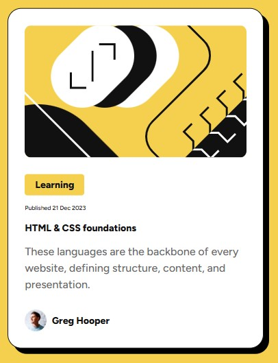

# Frontend Mentor - Blog preview card solution

This is a solution to the [Blog preview card challenge on Frontend Mentor](https://www.frontendmentor.io/challenges/blog-preview-card-ckPaj01IcS). Frontend Mentor challenges help you improve your coding skills by building realistic projects.

## Table of contents

- [Overview](#overview)
  - [The challenge](#the-challenge)
  - [Screenshot](#screenshot)
  - [Links](#links)
- [My process](#my-process)
  - [Built with](#built-with)
  - [What I learned](#what-i-learned)
  - [Continued development](#continued-development)
  - [Useful resources](#useful-resources)
- [Author](#author)

## Overview

### The challenge

Users should be able to:

- See hover and focus states for all interactive elements on the page

### Screenshot

### Links

- Solution URL: [https://github.com/yossybio/BlogPreviewCard](https://github.com/yossybio/BlogPreviewCard)
- Live Site URL: [https://yermian-blogpreviewcard.netlify.app/](https://yermian-blogpreviewcard.netlify.app/)

## My process

### Built with

- Semantic HTML5 markup
- CSS custom properties
- Flexbox
- [React](https://reactjs.org/) - JS library

### What I learned

This project has been an incredible learning experience. First, I learned how to create a React application using Vite. Additionally, it was an excellent opportunity to practice Flexbox techniques I studied in the HTML and CSS course, as well as to gain further hands-on experience with React.

### Continued development

In the next projects, i will practice more exercises from Fronted Mentor site, to be more better programmer.

### Useful resources

- [Build Responsive Real-World Websites with HTML and CSS](https://www.udemy.com/course/design-and-develop-a-killer-website-with-html5-and-css3/?couponCode=LETSLEARNNOWPP) - This course teached me what is Flexbox and how to use it right.
- [React - The Complete Guide 2024 (incl. React Router & Redux)](https://www.udemy.com/course/react-the-complete-guide-incl-redux/?couponCode=LETSLEARNNOWPP) - This course teached me React.js and how to use it correctly.

## Author

- Website - [Yossy Yermian](https://yossybio.github.io/cv/)
- Frontend Mentor - [@yossybio](https://www.frontendmentor.io/profile/yossybio)
